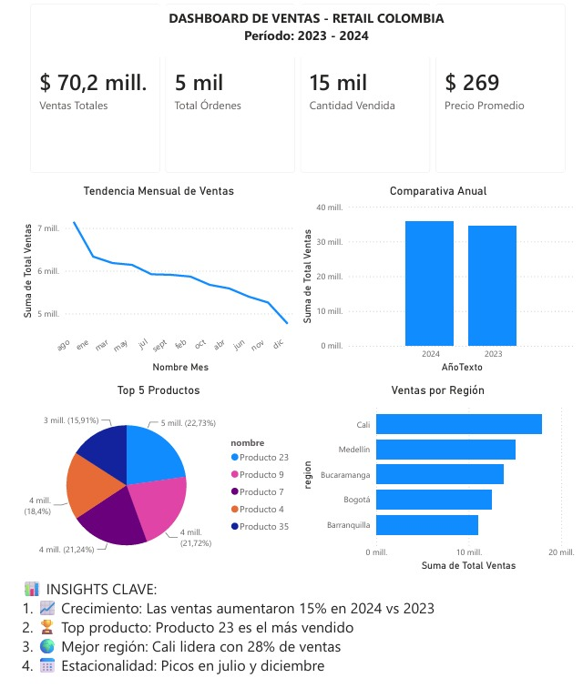

# 📊 Sales Analytics & Business Intelligence Platform for Retail Decision-Making

### Dashboard de Ventas - Retail Colombia


---

# 📌 Proyecto de Portafolio para Data Analytics & Business Intelligence

Este proyecto fue desarrollado para demostrar competencias prácticas en análisis de datos, Business Intelligence y visualización de información utilizando herramientas ampliamente empleadas en la industria.

La solución simula un entorno empresarial real donde la gerencia comercial requiere monitorear indicadores estratégicos, identificar oportunidades de crecimiento y apoyar la toma de decisiones basadas en datos.

### Competencias demostradas

✅ Data Analysis

✅ Business Intelligence

✅ Dashboard Design

✅ KPI Development

✅ Data Storytelling

✅ Data Modeling

✅ DAX

✅ Power Query

✅ Python para Analítica

✅ Exploratory Data Analysis (EDA)

---

# 🎯 Resumen Ejecutivo

Este proyecto desarrolla una plataforma de análisis comercial construida en Power BI para una empresa retail en Colombia.

Se utilizaron datos sintéticos generados con Python para simular operaciones comerciales reales durante el período 2023–2024. Posteriormente, se realizó el modelado de datos, la transformación mediante Power Query y la construcción de métricas de negocio utilizando DAX.

El dashboard permite monitorear el desempeño comercial mediante indicadores clave, analizar tendencias temporales, identificar productos de alto rendimiento y evaluar el comportamiento regional de las ventas.

## Resultados principales

| Indicador                | Resultado         |
| ------------------------ | ----------------- |
| Ventas Analizadas        | $70.2M            |
| Órdenes Procesadas       | 5,000             |
| Unidades Vendidas        | 15,000            |
| Crecimiento 2024 vs 2023 | +15%              |
| Ciudad Líder             | Cali              |
| Participación de Cali    | 28%               |
| Meses Pico               | Julio y Diciembre |

---

# 🖼️ Vista Previa del Dashboard



---

# 🏢 Contexto de Negocio

Las empresas retail generan grandes volúmenes de información transaccional diariamente. Sin embargo, convertir estos datos en información accionable requiere herramientas que permitan analizar tendencias, monitorear KPIs y detectar oportunidades de mejora.

Este dashboard busca responder preguntas estratégicas como:

* ¿Cómo evolucionan las ventas en el tiempo?
* ¿Qué productos generan mayores ingresos?
* ¿Qué regiones presentan mejor desempeño?
* ¿Existen patrones estacionales que afecten la demanda?
* ¿Qué oportunidades de crecimiento pueden identificarse?

---

# 📈 KPIs Estratégicos

| KPI                 | Valor  |
| ------------------- | ------ |
| 💰 Ventas Totales   | $70.2M |
| 🧾 Total Órdenes    | 5,000  |
| 📦 Cantidad Vendida | 15,000 |
| 🏷️ Precio Promedio | $269   |

---

# 🔍 Hallazgos de Negocio

## 📈 Crecimiento Comercial

Las ventas aumentaron aproximadamente un 15% durante 2024 frente a 2023, indicando una tendencia positiva en el desempeño comercial.

### Posible impacto

* Incremento en ingresos.
* Expansión de mercado.
* Mayor eficiencia comercial.

---

## 🏆 Producto Líder

El Producto 23 se posicionó como el producto más vendido dentro del portafolio.

### Posible impacto

* Priorización de inventario.
* Optimización de promociones.
* Estrategias de cross-selling.

---

## 🌎 Desempeño Regional

Cali representa aproximadamente el 28% de las ventas totales.

### Posible impacto

* Identificación de mercados estratégicos.
* Optimización de campañas regionales.
* Asignación eficiente de recursos comerciales.

---

## 📅 Estacionalidad

Se identificaron incrementos significativos de ventas durante:

* Julio
* Diciembre

### Posible impacto

* Planeación de inventarios.
* Optimización logística.
* Estrategias promocionales anticipadas.

---

# 📊 Visualizaciones Implementadas

## 💰 KPI Cards

Monitoreo rápido de indicadores clave del negocio.

* Ventas Totales
* Total Órdenes
* Cantidad Vendida
* Precio Promedio

---

## 📈 Tendencia Mensual de Ventas

Visualización temporal para identificar:

* Tendencias
* Estacionalidad
* Cambios en el comportamiento de compra

---

## 📊 Comparativa Anual

Comparación de ventas entre:

* 2023
* 2024

Permite evaluar crecimiento y desempeño comercial.

---

## 🏆 Top 5 Productos

Ranking de productos con mayores ventas para identificar los principales impulsores del negocio.

---

## 🌎 Ventas por Región

Distribución geográfica de ingresos para identificar mercados con mayor potencial.

---

# 🧠 Proceso Analítico

## 1. Generación de Datos

Se construyó un dataset sintético utilizando:

* Pandas
* NumPy
* Faker

Incluyendo:

* Clientes
* Productos
* Ventas
* Fechas
* Regiones

---

## 2. Transformación de Datos

Se realizaron procesos de limpieza y preparación utilizando Power Query.

Actividades realizadas:

* Validación de registros
* Estandarización de columnas
* Transformación de tipos de datos
* Preparación para modelado

---

## 3. Modelado de Datos

Se diseñó un modelo relacional basado en:

### Tabla de hechos

* ventas

### Tablas dimensión

* clientes
* productos

Modelo tipo estrella para optimizar análisis y rendimiento.

---

## 4. Desarrollo de KPIs

Construcción de medidas DAX para monitorear indicadores estratégicos.

---

## 5. Storytelling y Visualización

Diseño de dashboard enfocado en facilitar:

* Interpretación rápida
* Toma de decisiones
* Identificación de oportunidades

---

# 🏗️ Arquitectura del Proyecto

```text
Dashboard_Ventas_Retail_Colombia/
│
├── data/
│   ├── ventas.csv
│   ├── productos.csv
│   └── clientes.csv
│
├── scripts/
│   └── generate_data.py
│
├── powerbi/
│   └── Dashboard_Ventas_Retail_Colombia.pbix
│
├── images/
│   └── dashboard_preview.png
│
├── README.md
├── requirements.txt
└── .gitignore
```

---

# ⚙️ Tecnologías Utilizadas

| Tecnología       | Aplicación                         |
| ---------------- | ---------------------------------- |
| Python           | Generación y manipulación de datos |
| Pandas           | Análisis de datos                  |
| NumPy            | Operaciones numéricas              |
| Faker            | Datos sintéticos                   |
| Power BI Desktop | Dashboard                          |
| Power Query      | ETL y transformación               |
| DAX              | KPIs y métricas                    |
| Git              | Versionamiento                     |
| GitHub           | Portafolio y colaboración          |

---

# 🧮 Medidas DAX Implementadas

## Ventas Totales

```DAX
Ventas Totales =
SUM(ventas[total])
```

---

## Total Órdenes

```DAX
Total Órdenes =
COUNTROWS(ventas)
```

---

## Cantidad Vendida

```DAX
Cantidad Vendida =
SUM(ventas[cantidad])
```

---

## Precio Promedio

```DAX
Precio Promedio =
AVERAGE(ventas[precio_unitario])
```

---

## Ventas por Mes

```DAX
Ventas por Mes =
SUMMARIZE(
    ventas,
    ventas[Nombre Mes],
    "Total Ventas",
    SUM(ventas[total])
)
```

---

## Top Productos

```DAX
Top Productos =
TOPN(
    5,
    SUMMARIZE(
        ventas,
        productos[nombre],
        "Ventas",
        SUM(ventas[total])
    ),
    [Ventas],
    DESC
)
```

---

## Ventas por Región

```DAX
Ventas por Región =
SUMMARIZE(
    ventas,
    clientes[region],
    "Total Ventas",
    SUM(ventas[total])
)
```

---

# 📊 Modelo de Datos

```text
clientes (1)
      │
      │
      ▼
ventas
      ▲
      │
      │
productos (1)
```

### Entidades principales

| Tabla     | Descripción                          |
| --------- | ------------------------------------ |
| ventas    | Información transaccional            |
| productos | Catálogo de productos                |
| clientes  | Información geográfica y demográfica |

---

# 🛠️ Competencias Técnicas Demostradas

## Data Analysis

* Exploratory Data Analysis (EDA)
* Trend Analysis
* Sales Analytics
* Regional Analysis
* Seasonal Analysis

## Business Intelligence

* Dashboard Development
* KPI Design
* Executive Reporting
* Data Visualization
* Business Storytelling

## Data Modeling

* Star Schema
* Fact and Dimension Tables
* Relational Modeling

## Analytics Engineering

* Synthetic Data Generation
* Data Transformation
* ETL Processes
* Data Validation

## Herramientas

* Power BI
* DAX
* Power Query
* Python
* Pandas
* NumPy
* Faker
* Git
* GitHub

---

# 💼 Impacto de Negocio

| Área           | Beneficio                                                  |
| -------------- | ---------------------------------------------------------- |
| 📈 Ventas      | Identificación de productos y regiones con mayor potencial |
| 🎯 Marketing   | Planeación de campañas según estacionalidad                |
| 📦 Operaciones | Optimización de inventarios                                |
| 💰 Finanzas    | Proyección de ingresos y planificación financiera          |
| 📊 Dirección   | Mejor toma de decisiones basada en datos                   |

---

# 📋 Principales Aprendizajes

Durante el desarrollo de este proyecto se fortalecieron habilidades en:

* Business Intelligence
* Visualización de datos
* Diseño de dashboards ejecutivos
* Modelado de datos
* DAX
* Power Query
* Python para analítica
* Storytelling con datos
* Toma de decisiones basada en KPIs

---

# 🎓 Relevancia para Ciencia de Datos

Aunque este proyecto está enfocado en Business Intelligence, constituye una base sólida para iniciativas de Data Science y Machine Learning.

Los datos y métricas construidos pueden utilizarse posteriormente para:

* Forecasting de ventas
* Detección de anomalías
* Segmentación de clientes
* Sistemas de recomendación
* Optimización de inventarios
* Modelos predictivos de demanda

---

# 👨‍💻 Autor

**Jhorman David Bernal Tapias**

💻 GitHub: [github.com/David-cyber06]

📧 Correo: [[jhormandavid2000@gmail.com](mailto:jhormandavid2000@gmail.com)]

---
