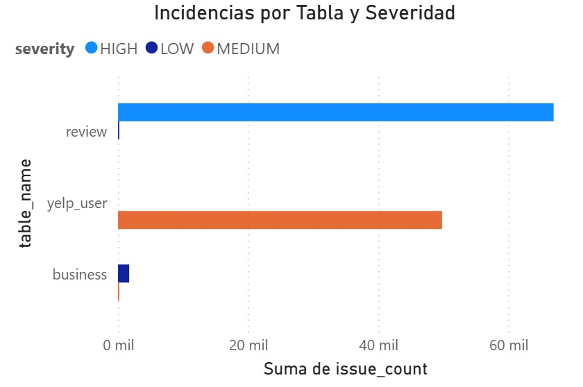

# 🔎 SQL Data Quality Audit & Business Intelligence Dashboard

### Auditoría de Calidad de Datos sobre Yelp Dataset


---

# 📌 Proyecto de Portafolio para Data Analytics, SQL & Business Intelligence

Este proyecto fue desarrollado para demostrar competencias en auditoría de calidad de datos, análisis exploratorio, SQL avanzado, visualización de datos y Business Intelligence.

La solución simula un escenario real donde una organización necesita evaluar la confiabilidad de sus datos antes de utilizarlos en procesos analíticos, reportes ejecutivos o modelos de Machine Learning.

### Competencias demostradas

✅ SQL Analytics

✅ Data Quality Assessment

✅ Data Validation

✅ PostgreSQL

✅ Dashboard Development

✅ Business Intelligence

✅ Data Visualization

✅ Python Data Engineering

✅ Root Cause Analysis

✅ Data Storytelling

---

# 🎯 Resumen Ejecutivo

La calidad de los datos es uno de los factores más importantes para garantizar decisiones confiables dentro de una organización.

En este proyecto se realizó una auditoría integral sobre un subconjunto del dataset de Yelp utilizando PostgreSQL para identificar inconsistencias, registros faltantes y problemas de integridad entre tablas.

Posteriormente, los resultados fueron visualizados mediante un dashboard ejecutivo en Power BI para facilitar la priorización de acciones correctivas y la comunicación de hallazgos a stakeholders técnicos y de negocio.

## Resultados principales

| Indicador                | Resultado |
| ------------------------ | --------- |
| Incidencias Detectadas   | 118,568   |
| Tablas Auditadas         | 3         |
| Incidencias Críticas     | 66,968    |
| Incidencias Medias       | 49,886    |
| Incidencias Bajas        | 1,714     |
| Tasa de Calidad de Datos | 44%       |

---

# 🏢 Contexto de Negocio

Las organizaciones dependen cada vez más de los datos para tomar decisiones estratégicas.

Sin embargo, cuando los datos presentan errores, inconsistencias o registros incompletos, los análisis pueden conducir a conclusiones incorrectas, pérdidas económicas y decisiones de negocio deficientes.

Este proyecto busca responder preguntas críticas como:

* ¿Qué tan confiables son los datos?
* ¿Qué tablas presentan mayores problemas?
* ¿Cuáles son las incidencias más críticas?
* ¿Dónde deberían enfocarse los esfuerzos de limpieza?
* ¿Qué riesgos representan estos problemas para el negocio?

---

# 🚨 Principales Hallazgos

## ⚠️ Total de Incidencias Detectadas

Se identificaron **118,568 problemas de calidad de datos** distribuidos entre múltiples tablas del sistema.

### Impacto potencial

* Reportes incorrectos.
* Métricas inconsistentes.
* Sesgos en análisis posteriores.
* Problemas en modelos predictivos.

---

## 🔴 Problema Más Crítico

Se encontraron **66,968 reviews sin usuario asociado**, representando la incidencia más grave de toda la auditoría.

### Riesgo para el negocio

* Pérdida de trazabilidad.
* Imposibilidad de analizar comportamiento de usuarios.
* Problemas de integridad referencial.

---

## 📊 Tabla Más Afectada

La tabla **review** concentró el mayor número de incidencias.

### Impacto potencial

* Distorsión de métricas de engagement.
* Sesgos en análisis de reputación.
* Resultados inconsistentes en sistemas de recomendación.

---

## 📉 Calidad General de los Datos

La auditoría determinó una tasa global de calidad de datos del:

# 44%

Esto evidencia oportunidades significativas de mejora antes de utilizar la información para procesos analíticos avanzados.

---

# 📈 KPIs de Calidad de Datos

| KPI                   | Valor   |
| --------------------- | ------- |
| 🚨 Total Incidencias  | 118,568 |
| 🗃️ Tablas Auditadas  | 3       |
| 🔴 Incidencias HIGH   | 66,968  |
| 🟠 Incidencias MEDIUM | 49,886  |
| 🟡 Incidencias LOW    | 1,714   |
| 📊 Data Quality Score | 44%     |

---

# 📊 Distribución de Incidencias por Tabla

| Tabla     | HIGH   | MEDIUM | LOW   | Total  |
| --------- | ------ | ------ | ----- | ------ |
| review    | 66,968 | 0      | 3     | 66,971 |
| yelp_user | 0      | 49,812 | 0     | 49,812 |
| business  | 0      | 37     | 1,711 | 1,748  |

---

# 🔍 Problemas Detectados

## Ranking de Incidencias

| # | Problema                               | Tabla     | Cantidad | Severidad |
| - | -------------------------------------- | --------- | -------- | --------- |
| 1 | Reviews sin usuario asociado           | review    | 66,968   | HIGH      |
| 2 | review_count inconsistente             | yelp_user | 49,812   | MEDIUM    |
| 3 | address vacío o nulo                   | business  | 1,691    | LOW       |
| 4 | Negocios sin categorías                | business  | 37       | MEDIUM    |
| 5 | categories vacío o nulo                | business  | 37       | MEDIUM    |
| 6 | Reviews con texto extremadamente corto | review    | 3        | LOW       |

---

# 🧠 Metodología de Auditoría

## 1. Carga y Preparación de Datos

Se utilizó Python para preparar y cargar la información en PostgreSQL.

### Herramientas utilizadas

* Pandas
* PostgreSQL
* pgAdmin4

---

## 2. Auditoría SQL

Se diseñaron consultas para detectar:

* Valores nulos
* Campos vacíos
* Inconsistencias de conteo
* Problemas de integridad referencial
* Registros huérfanos
* Calidad de atributos críticos

---

## 3. Consolidación de Hallazgos

Los resultados fueron centralizados en una tabla de auditoría para facilitar el análisis y visualización.

---

## 4. Visualización Ejecutiva

Se construyó un dashboard interactivo en Power BI para comunicar los hallazgos de forma clara y accionable.

---

# 📊 Dashboard de Business Intelligence

## Vista General


Dashboard ejecutivo con KPIs principales y resumen general de incidencias.

---

## Incidencias por Tabla y Severidad



Permite identificar rápidamente qué tablas requieren atención prioritaria.

---

## Incidencias por Tipo de Problema


Análisis detallado de las causas principales de deterioro de calidad.

---

## Distribución por Severidad


Clasificación de problemas según impacto potencial para el negocio.

---

# 📊 Visualizaciones Implementadas

## KPI Cards

* Total Incidencias
* Incidencias HIGH
* Incidencias MEDIUM
* Data Quality Score

---

## Distribución por Tabla

Visualización de las incidencias agrupadas por entidad de negocio.

---

## Distribución por Severidad

Clasificación de riesgos:

* HIGH
* MEDIUM
* LOW

---

## Tipología de Problemas

Análisis de causas raíz y patrones de calidad.

---

# 🏗️ Arquitectura del Proyecto

```text
02-sql-data-quality-audit/
│
├── README.md
├── data_quality_audit.sql
├── data_quality_audit.ipynb
│
├── data/
│   └── audit_results.csv
│
├── sql/
│   ├── 01_create_tables.sql
│   └── 02_audit_queries.sql
│
└── images/
    ├── 01_data_quality_dashboard.jpeg
    ├── 02_incidencias_por_tabla.jpeg
    ├── 03_incidencias_por_tipo.jpeg
    └── 04_severidad.jpeg
```

---

# ⚙️ Tecnologías Utilizadas

| Tecnología | Aplicación                      |
| ---------- | ------------------------------- |
| PostgreSQL | Almacenamiento y consultas      |
| SQL        | Auditoría y validación          |
| Python     | Preparación y carga de datos    |
| Pandas     | Manipulación de datos           |
| pgAdmin4   | Administración de base de datos |
| Power BI   | Dashboard ejecutivo             |
| Git        | Versionamiento                  |
| GitHub     | Portafolio profesional          |

---

# 💡 Ejemplos de Validaciones SQL

## Integridad Referencial

```sql
SELECT COUNT(*)
FROM review r
LEFT JOIN yelp_user u
ON r.user_id = u.user_id
WHERE u.user_id IS NULL;
```

---

## Validación de Direcciones Vacías

```sql
SELECT COUNT(*)
FROM business
WHERE address IS NULL
OR TRIM(address) = '';
```

---

## Validación de Categorías

```sql
SELECT COUNT(*)
FROM business
WHERE categories IS NULL
OR TRIM(categories) = '';
```

---

# 🛠️ Competencias Técnicas Demostradas

## SQL Analytics

* Joins avanzados
* Data Validation
* Data Profiling
* Data Quality Assessment
* Query Optimization

## Data Analysis

* Root Cause Analysis
* Exploratory Data Analysis
* KPI Development
* Trend Identification

## Business Intelligence

* Dashboard Design
* Executive Reporting
* Data Storytelling
* Visual Analytics

## Data Engineering

* Data Loading
* Data Preparation
* ETL Foundations
* Database Management

## Herramientas

* SQL
* PostgreSQL
* Python
* Pandas
* Power BI
* pgAdmin4
* Git
* GitHub

---

# 💼 Impacto de Negocio

| Área                | Beneficio                                         |
| ------------------- | ------------------------------------------------- |
| 📊 Analytics        | Mejora la confiabilidad de los análisis           |
| 🤖 Machine Learning | Reduce sesgos derivados de datos incorrectos      |
| 💰 Finanzas         | Evita decisiones basadas en información errónea   |
| 📈 Operaciones      | Prioriza esfuerzos de limpieza de datos           |
| 🏢 Dirección        | Incrementa la confianza en indicadores y reportes |

---

# 📋 Principales Aprendizajes

Durante el desarrollo del proyecto se fortalecieron habilidades en:

* SQL avanzado
* Auditoría de calidad de datos
* Integridad referencial
* Data Governance
* PostgreSQL
* Python para preparación de datos
* Power BI
* Comunicación de hallazgos técnicos
* Data Storytelling

---

# 🎓 Relevancia para Data Science y Analytics

La calidad de datos es una etapa crítica dentro de cualquier proyecto analítico.

Los problemas detectados en esta auditoría podrían afectar directamente:

* Modelos de Machine Learning.
* Sistemas de recomendación.
* Forecasting.
* Segmentación de clientes.
* Dashboards ejecutivos.
* Reportes financieros.

Por esta razón, la auditoría de calidad constituye una de las competencias fundamentales para Data Analysts, Data Scientists y Analytics Engineers.

---

# 👨‍💻 Autor

**Jhorman David Bernal Tapias**

💻 GitHub: [github.com/David-cyber06]
