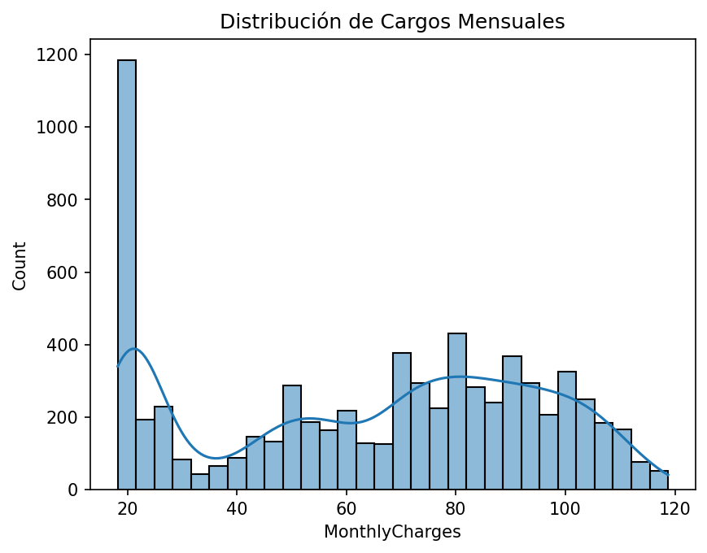
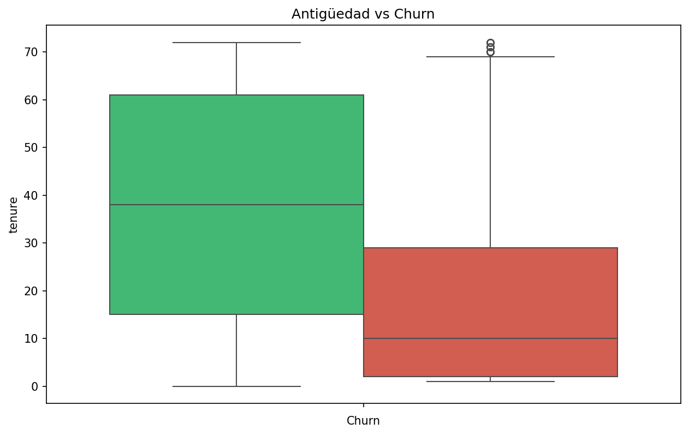
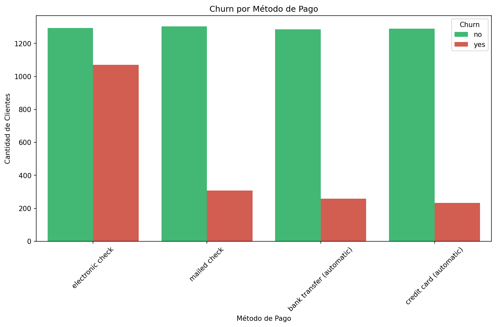
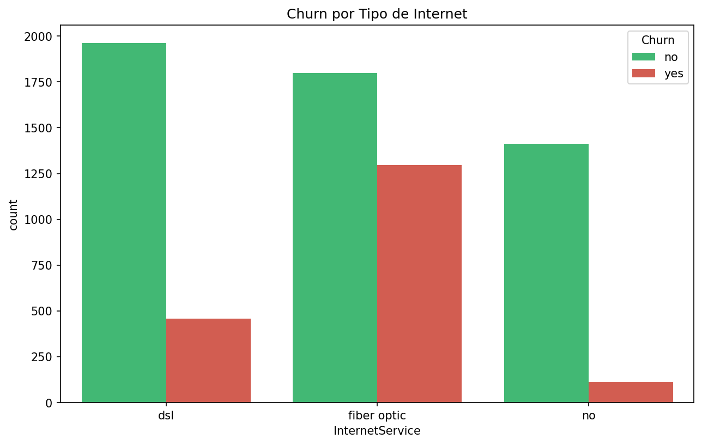
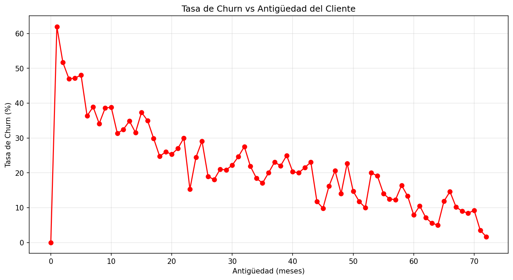

# 📉 Customer Churn Analytics & Exploratory Data Analysis

### Telco Customer Churn Analysis

---

# 📌 Proyecto de Portafolio para Data Science, Customer Analytics y Business Intelligence

Este proyecto fue desarrollado para demostrar competencias en limpieza de datos, análisis exploratorio (EDA), análisis de comportamiento de clientes, visualización de datos y generación de insights de negocio.

La solución aborda uno de los problemas más importantes en industrias de suscripción: la pérdida de clientes (*customer churn*).

A través del análisis de datos históricos de una empresa de telecomunicaciones, se identifican patrones asociados a la cancelación de servicios y se generan recomendaciones accionables para mejorar la retención.

### Competencias demostradas

✅ Data Cleaning

✅ Exploratory Data Analysis (EDA)

✅ Customer Analytics

✅ Churn Analysis

✅ Business Analytics

✅ Statistical Visualization

✅ Data Storytelling

✅ Feature Understanding

✅ Business Insights Generation

✅ Python para Analítica

---

# 🎯 Resumen Ejecutivo

La retención de clientes representa uno de los principales desafíos para empresas de telecomunicaciones, ya que adquirir nuevos clientes suele ser significativamente más costoso que conservar los existentes.

En este proyecto se realizó un análisis exploratorio completo sobre más de 7,000 clientes con el objetivo de identificar los factores asociados al abandono del servicio.

El análisis permitió detectar segmentos de alto riesgo, patrones de comportamiento y variables relacionadas con la probabilidad de churn, proporcionando información valiosa para diseñar estrategias de retención.

## Resultados principales

| Indicador                | Resultado  |
| ------------------------ | ---------- |
| Clientes Analizados      | 7,043      |
| Clientes Perdidos        | 1,869      |
| Tasa de Churn            | 26.54%     |
| Tasa de Retención        | 73.46%     |
| Ingreso Mensual Promedio | $64.76     |
| Ingreso Total Promedio   | $2,279.73  |
| Antigüedad Promedio      | 32.4 meses |

---

# 🏢 Contexto de Negocio

La pérdida de clientes tiene un impacto directo sobre los ingresos, la rentabilidad y el crecimiento sostenible de una organización.

Comprender qué características presentan los clientes que abandonan el servicio permite diseñar estrategias preventivas y optimizar la experiencia del cliente.

Este proyecto busca responder preguntas estratégicas como:

* ¿Cuál es la magnitud del churn?
* ¿Qué perfiles presentan mayor riesgo de abandono?
* ¿Cómo influye la antigüedad del cliente?
* ¿Existen métodos de pago asociados a mayor churn?
* ¿Qué tipos de contrato presentan más riesgo?
* ¿Qué acciones podrían reducir la pérdida de clientes?

---

# 🚨 Hallazgos Principales

## ⚠️ Tasa de Churn Elevada

La empresa presenta una tasa de churn de:

# 26.54%

Esto significa que aproximadamente 1 de cada 4 clientes abandona el servicio.

### Impacto potencial

* Reducción de ingresos recurrentes.
* Incremento de costos de adquisición.
* Menor crecimiento del negocio.

---

## 📉 Riesgo Crítico en Clientes Nuevos

Los clientes con menor antigüedad presentan una probabilidad significativamente mayor de cancelar el servicio.

### Impacto potencial

* Problemas en onboarding.
* Expectativas no cumplidas.
* Experiencia inicial deficiente.

---

## 📋 Contratos Mensuales

Los clientes con contratos mensuales presentan una tasa de churn considerablemente superior a quienes tienen contratos de largo plazo.

### Impacto potencial

* Menor fidelización.
* Mayor sensibilidad a la competencia.
* Mayor volatilidad de ingresos.

---

## 💳 Método de Pago

Los usuarios que utilizan **Electronic Check** muestran una mayor propensión al abandono.

### Impacto potencial

* Fricción en procesos de pago.
* Menor compromiso con el servicio.

---

## 🌐 Tipo de Internet

Los clientes con servicio **Fiber Optic** presentan una tasa de churn superior a quienes utilizan DSL.

### Impacto potencial

* Problemas de satisfacción.
* Calidad percibida del servicio.
* Expectativas elevadas del cliente.

---

# 📈 KPIs del Negocio

| KPI                         | Valor      |
| --------------------------- | ---------- |
| 👥 Total Clientes           | 7,043      |
| ❌ Clientes Perdidos         | 1,869      |
| 📉 Tasa de Churn            | 26.54%     |
| ✅ Tasa de Retención         | 73.46%     |
| 💰 Ingreso Mensual Promedio | $64.76     |
| 💵 Ingreso Total Promedio   | $2,279.73  |
| 📆 Antigüedad Promedio      | 32.4 meses |
| 🆕 Clientes Nuevos          | 11         |

---

# 🧠 Metodología Analítica

## 1. Carga y Exploración Inicial

Se realizó una inspección completa del dataset para comprender:

* Estructura de variables
* Tipos de datos
* Valores faltantes
* Distribuciones iniciales

---

## 2. Limpieza de Datos

Procesos realizados:

* Conversión de variables numéricas
* Tratamiento de valores vacíos
* Corrección de tipos de datos
* Validación de registros inconsistentes

---

## 3. Análisis Exploratorio (EDA)

Se analizaron:

### Variables Numéricas

* tenure
* MonthlyCharges
* TotalCharges

### Variables Categóricas

* Contract
* PaymentMethod
* InternetService
* Churn

---

## 4. Análisis Bivariante

Evaluación de relaciones entre churn y variables clave:

* Antigüedad
* Tipo de contrato
* Método de pago
* Tipo de internet
* Facturación mensual

---

## 5. Generación de Insights

Identificación de patrones con impacto directo sobre estrategias de retención.

---

# 📊 Visualizaciones Implementadas

## Distribución de Total Charges

Permite validar la calidad y comportamiento de la variable antes y después de la limpieza.

---

## Distribución de Churn

Análisis general del comportamiento de abandono.

---

## Distribución de Antigüedad

Evaluación de la permanencia de los clientes.

---

## Distribución de Cargos Mensuales

Análisis de la estructura de ingresos.

---

## Churn vs Antigüedad

Identificación del riesgo según tiempo de permanencia.

---

## Churn vs Monthly Charges

Evaluación de la relación entre precio y abandono.

---

## Churn vs Total Charges

Análisis del valor económico asociado a clientes retenidos y perdidos.

---

## Matriz de Correlación

Identificación de relaciones entre variables numéricas.

---

## Churn por Tipo de Contrato

Comparación del riesgo según modalidad contractual.

---

## Churn por Método de Pago

Análisis del impacto de los medios de pago.

---

## Churn por Tipo de Internet

Evaluación del comportamiento según servicio contratado.

---

## Tasa de Churn vs Antigüedad

Visualización de la evolución del riesgo a lo largo del ciclo de vida del cliente.

---

# ⚙️ Tecnologías Utilizadas

| Tecnología       | Aplicación                |
| ---------------- | ------------------------- |
| Python           | Análisis de datos         |
| Pandas           | Limpieza y transformación |
| NumPy            | Operaciones numéricas     |
| Matplotlib       | Visualización             |
| Seaborn          | Visualización estadística |
| KaggleHub        | Obtención del dataset     |
| Jupyter Notebook | Desarrollo del análisis   |
| Git              | Versionamiento            |
| GitHub           | Portafolio profesional    |

---

# 🛠️ Competencias Técnicas Demostradas

## Data Analysis

* Exploratory Data Analysis (EDA)
* Customer Analytics
* Churn Analysis
* Business Metrics Analysis
* Trend Identification

## Data Cleaning

* Missing Values Handling
* Data Type Conversion
* Data Validation
* Data Preparation

## Statistical Analysis

* Distribution Analysis
* Correlation Analysis
* Segmentation Analysis
* Feature Exploration

## Business Intelligence

* KPI Development
* Executive Reporting
* Data Storytelling
* Insight Generation

## Herramientas

* Python
* Pandas
* NumPy
* Matplotlib
* Seaborn
* Jupyter Notebook
* Git
* GitHub

---

# 💡 Recomendaciones Estratégicas

| # | Recomendación                                           | Impacto Esperado                 |
| - | ------------------------------------------------------- | -------------------------------- |
| 1 | Implementar programa de onboarding para clientes nuevos | Reducir churn temprano           |
| 2 | Incentivar migración a contratos anuales                | Incrementar retención            |
| 3 | Promover métodos de pago automáticos                    | Reducir abandono                 |
| 4 | Revisar experiencia de clientes Fiber Optic             | Mejorar satisfacción             |
| 5 | Monitorear churn mensualmente                           | Detectar problemas oportunamente |

---

# 💼 Impacto de Negocio

| Área                | Beneficio                                      |
| ------------------- | ---------------------------------------------- |
| 📈 Ventas           | Incremento potencial de ingresos por retención |
| 💰 Finanzas         | Reducción de costos de adquisición             |
| 🎯 Marketing        | Segmentación de campañas de fidelización       |
| 🤝 Customer Success | Identificación temprana de clientes en riesgo  |
| 🏢 Dirección        | Mejor toma de decisiones basada en datos       |

---

# 📋 Principales Aprendizajes

Durante el desarrollo de este proyecto se fortalecieron habilidades en:

* Customer Analytics
* Churn Analysis
* Data Cleaning
* Exploratory Data Analysis
* Visualización de Datos
* Storytelling con Datos
* Interpretación de KPIs
* Generación de recomendaciones de negocio

---

# 🎓 Relevancia para Data Science y Machine Learning

Este proyecto representa una de las problemáticas más comunes dentro de Data Science aplicada al negocio: la predicción y prevención de pérdida de clientes.

Los hallazgos obtenidos pueden utilizarse posteriormente para desarrollar:

* Modelos de clasificación supervisada.
* Sistemas de alerta temprana.
* Segmentación de clientes.
* Customer Lifetime Value (CLV).
* Estrategias de retención basadas en Machine Learning.
* Sistemas de recomendación de acciones comerciales.

Por esta razón, el análisis de churn constituye una de las competencias más valoradas para roles de Data Analyst, Data Scientist y Applied Machine Learning Engineer.

---

# 👨‍💻 Autor

**Jhorman David Bernal Tapias**

💻 GitHub: [github.com/David-cyber06]

