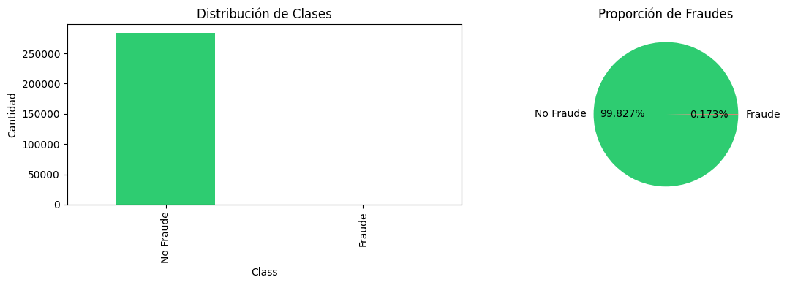
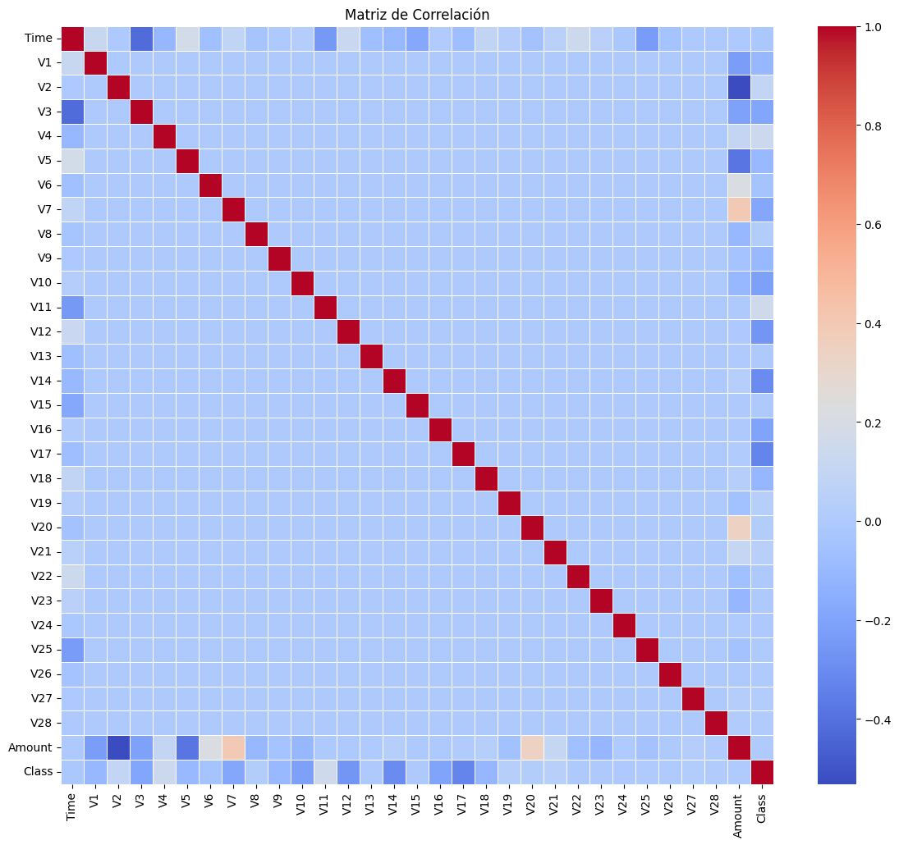
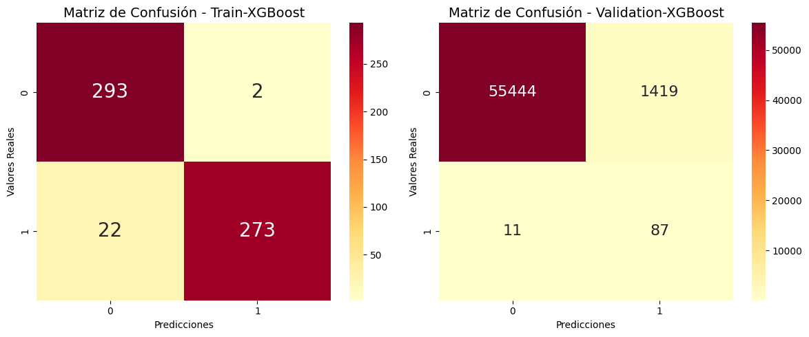
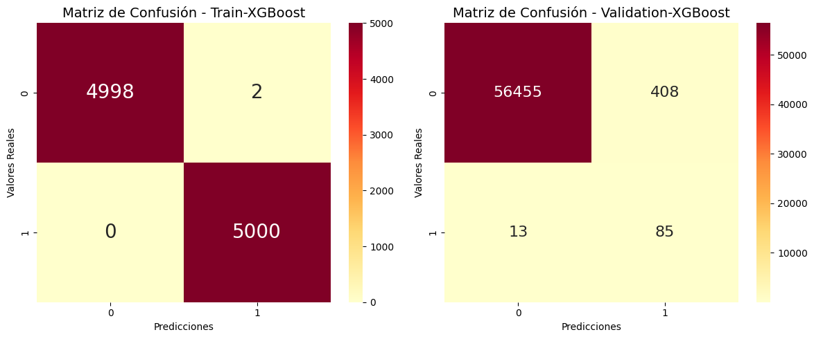
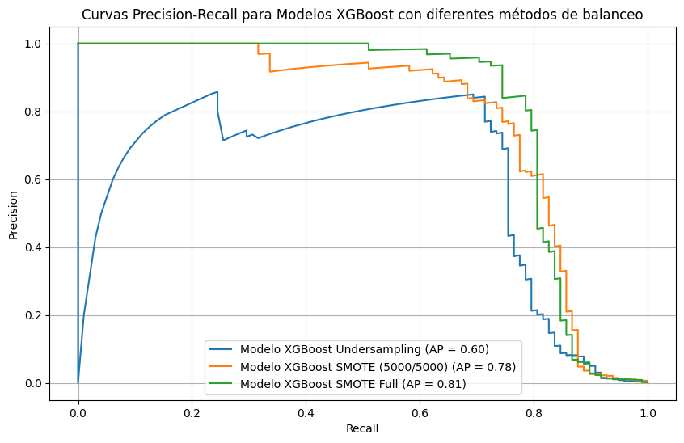
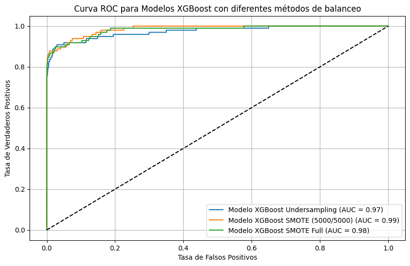
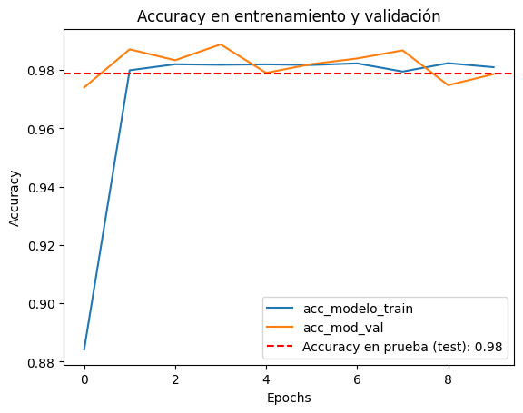
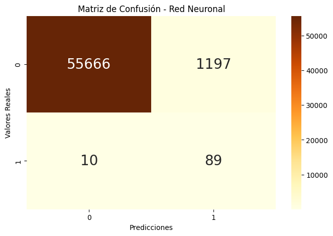
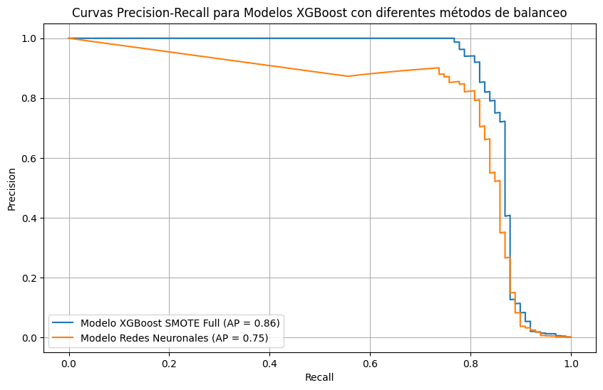
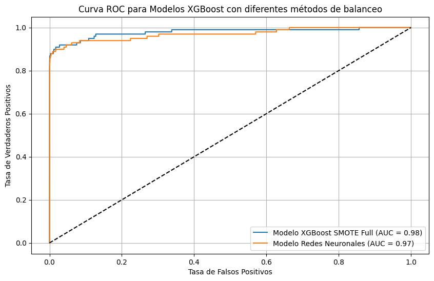

# 🛡️ Credit Card Fraud Detection using Machine Learning

### XGBoost (UnderSampling vs SMOTE) vs Neural Networks


---

# 📌 Descripción del Proyecto

Este proyecto consiste en el desarrollo de modelos de Machine Learning para la detección de fraude en transacciones con tarjetas de crédito.

Se implementaron distintas estrategias para abordar el fuerte desbalance de clases presente en el dataset, comparando múltiples técnicas de balanceo y diferentes algoritmos de clasificación.

El objetivo principal fue construir un sistema capaz de identificar transacciones fraudulentas minimizando la cantidad de falsas alarmas y maximizando la capacidad de detección.

---

# 🎯 Objetivos del Proyecto

- Analizar un dataset altamente desbalanceado de fraude financiero.
- Implementar técnicas de balanceo de clases.
- Comparar diferentes estrategias de entrenamiento.
- Evaluar modelos mediante métricas adecuadas para problemas desbalanceados.
- Comparar modelos basados en árboles y redes neuronales.
- Seleccionar la mejor solución para detección de fraude.

---

# 📊 Dataset

## Fuente

Credit Card Fraud Detection Dataset

## Variable Objetivo

```text
Class
0 = Transacción legítima
1 = Transacción fraudulenta
```

## Características del Dataset

- Más de 280.000 transacciones.
- Variables anonimizadas mediante PCA.
- Variables Time y Amount.
- Problema altamente desbalanceado.
- Solo aproximadamente 0.17% de las observaciones corresponden a fraude.

---

# 📈 Resumen del Problema

La detección de fraude financiero representa uno de los principales desafíos dentro del sector bancario y de pagos digitales.

Los sistemas tradicionales basados en reglas suelen generar una gran cantidad de falsos positivos o perder eventos de fraude importantes.

Por ello, Machine Learning permite construir modelos capaces de identificar patrones complejos asociados a transacciones fraudulentas.

---

# 🔍 Análisis Exploratorio de Datos (EDA)

Se realizó un análisis exploratorio para comprender la estructura del dataset.

## Distribución de la Variable Objetivo



### Hallazgo

El dataset presenta un desbalance extremo, donde las transacciones fraudulentas representan menos del 1% de las observaciones.

---

## Matriz de Correlación



### Hallazgo

Se identificaron variables con relaciones relevantes respecto a la variable objetivo, útiles para la detección de fraude.

---

# ⚙️ Preparación de Datos

## División del Dataset

Se utilizó una estrategia de separación en:

- Training Set
- Validation Set
- Test Set

Esto permitió realizar selección de modelos sin contaminar la evaluación final.

---

# ⚖️ Balanceo de Clases

Debido al fuerte desbalance del dataset se implementaron tres estrategias:

## 1. UnderSampling

Reducción de la clase mayoritaria para equilibrar el conjunto de entrenamiento.

### Ventajas

- Entrenamiento rápido.
- Dataset balanceado.

### Desventajas

- Pérdida significativa de información.

---

## 2. SMOTE (5000 / 5000)

Generación sintética de ejemplos de fraude hasta alcanzar una distribución balanceada controlada.

---

## 3. SMOTE Full

Generación sintética utilizando toda la información disponible de la clase minoritaria.

Esta estrategia produjo los mejores resultados.

---

# 🤖 Modelos Entrenados

## Modelo 1 — XGBoost + UnderSampling

Primer modelo entrenado utilizando reducción de la clase mayoritaria.

### Matriz de Confusión



---

## Modelo 2 — XGBoost + SMOTE (5000/5000)

Modelo entrenado mediante balanceo sintético moderado.

### Matriz de Confusión



---

## Modelo 3 — XGBoost + SMOTE Full

Modelo entrenado utilizando toda la información disponible para generación sintética.

### Matriz de Confusión


---

## Precision-Recall Curve para Modelos XGBoost



### Interpretación

SMOTE Full obtuvo el mayor Average Precision (AP), mostrando el mejor equilibrio entre precisión y capacidad de detección.

---

## ROC Curve para Modelos XGBoost



### Interpretación

Todos los modelos mostraron excelente capacidad de discriminación, con valores ROC-AUC superiores a 0.97.

---

# 🏆 Evaluación Final del Modelo Ganador

## XGBoost + SMOTE Full

### Matriz de Confusión en Test


Esta evaluación se realizó sobre el conjunto de prueba completamente aislado, permitiendo estimar el desempeño real del modelo sobre datos no vistos.

---

# 🧠 Red Neuronal Multicapa

Se desarrolló una red neuronal para comparar su desempeño frente a XGBoost.

## Curvas de Entrenamiento



### Observación

El entrenamiento mostró convergencia estable sin evidencia significativa de sobreajuste.

---

## Matriz de Confusión



### Observación

La red neuronal logró detectar la mayoría de los fraudes, aunque presentó una cantidad considerablemente mayor de falsos positivos que XGBoost.

---

# 📏 Métricas Utilizadas

Dado el fuerte desbalance de clases, se utilizaron múltiples métricas de evaluación:

- Accuracy
- Precision
- Recall
- F1 Score
- Specificity
- ROC Curve
- ROC-AUC
- Precision-Recall Curve
- Average Precision (AP)

---

# 📊 Comparación de Modelos

| Modelo | AP | ROC-AUC |
|----------|----------|----------|
| XGBoost UnderSampling | 0.60 | 0.97 |
| XGBoost SMOTE (5000/5000) | 0.78 | 0.99 |
| XGBoost SMOTE Full | **0.86** | **0.98** |
| Red Neuronal | 0.75 | 0.97 |

---

# 📈 Comparación Final: Precision-Recall Curve



### Interpretación

La curva Precision-Recall evidencia una ventaja clara de XGBoost + SMOTE Full frente a la red neuronal.

| Modelo | AP |
|----------|----------|
| XGBoost + SMOTE Full | **0.86** |
| Red Neuronal | 0.75 |

---

# 📉 Comparación Final: ROC Curve



### Interpretación

Ambos modelos presentan una excelente capacidad de discriminación.

| Modelo | ROC-AUC |
|----------|----------|
| XGBoost + SMOTE Full | **0.98** |
| Red Neuronal | 0.97 |

Aunque la diferencia en ROC-AUC es pequeña, la métrica Average Precision mostró una ventaja mucho más marcada para XGBoost, razón por la cual fue seleccionado como modelo final.

---

# 🏆 Modelo Ganador

## XGBoost + SMOTE Full

### Resultados Finales

| Métrica | Valor |
|----------|----------|
| Average Precision (AP) | **0.86** |
| ROC-AUC | **0.98** |

### Razones de Selección

- Mejor Average Precision.
- Excelente ROC-AUC.
- Menor cantidad de falsos positivos.
- Mejor equilibrio entre Precision y Recall.
- Mayor robustez frente al desbalance de clases.

---

# 📋 Conclusiones

Los resultados demostraron que las estrategias de balanceo tienen un impacto significativo en el desempeño de los modelos de detección de fraude.

### Hallazgos Principales

- UnderSampling produjo una pérdida importante de información.
- Los modelos entrenados con SMOTE superaron ampliamente al UnderSampling.
- La Red Neuronal mostró buen desempeño general, pero fue superada por XGBoost.
- XGBoost combinado con SMOTE Full obtuvo el mejor equilibrio entre capacidad de detección y reducción de falsas alarmas.
- Average Precision resultó ser una métrica más informativa que ROC-AUC para este problema altamente desbalanceado.

En consecuencia, el modelo seleccionado para despliegue sería **XGBoost + SMOTE Full**.

---

# 🛠️ Tecnologías Utilizadas

- Python
- Pandas
- NumPy
- Matplotlib
- Seaborn
- Scikit-Learn
- XGBoost
- Imbalanced-Learn (SMOTE)
- TensorFlow / Keras
- Jupyter Notebook
- Git
- GitHub

---

# 💼 Competencias Demostradas

## Data Science

- Exploratory Data Analysis (EDA)
- Feature Analysis
- Data Preprocessing
- Class Imbalance Handling

## Machine Learning

- Binary Classification
- Fraud Detection
- Ensemble Learning
- Gradient Boosting
- Neural Networks

## Model Evaluation

- Precision
- Recall
- F1 Score
- Specificity
- ROC-AUC
- Precision-Recall Analysis
- Average Precision

---

# 🎓 Aplicaciones

Este proyecto es representativo de problemas reales en:

- FinTech
- Bancos
- Sistemas de Pago
- Gestión de Riesgo
- Detección de Fraude
- Ciberseguridad Financiera

---

## 👨‍💻 Autor

**Jhorman David Bernal Tapias**  
Biochemical Engineering Student | Data Science & Machine Learning Portfolio

Proyecto desarrollado con fines educativos y de portafolio profesional.
