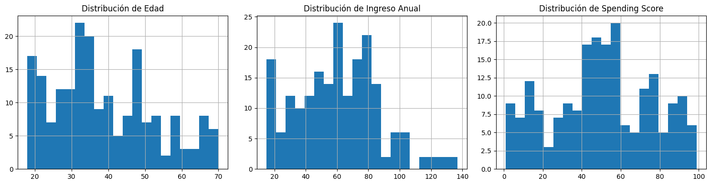
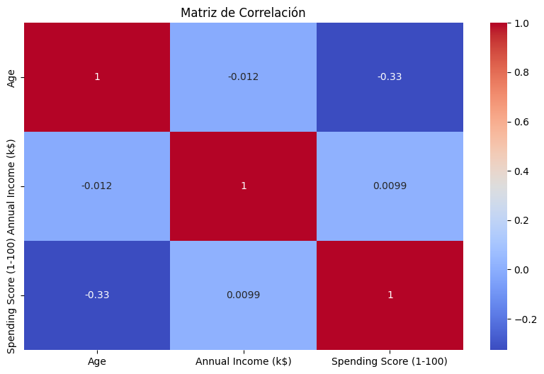
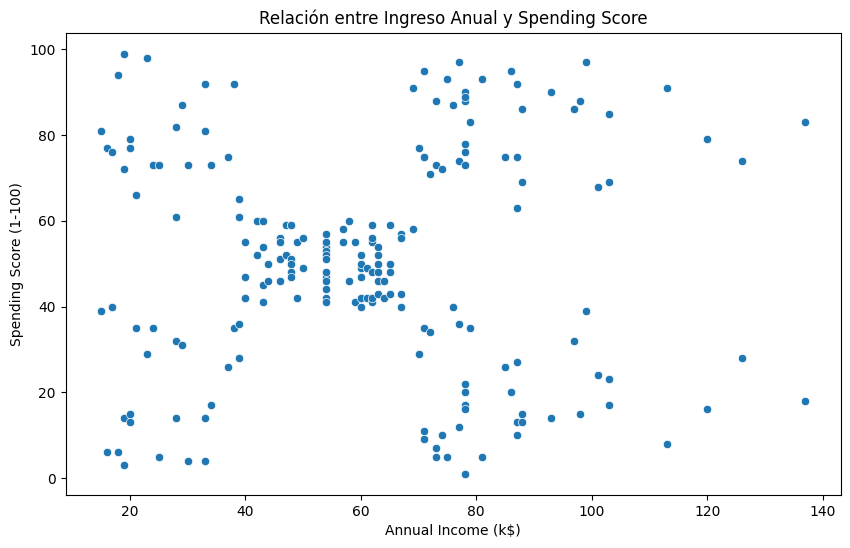
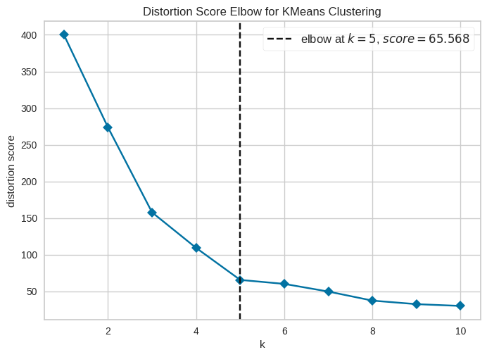
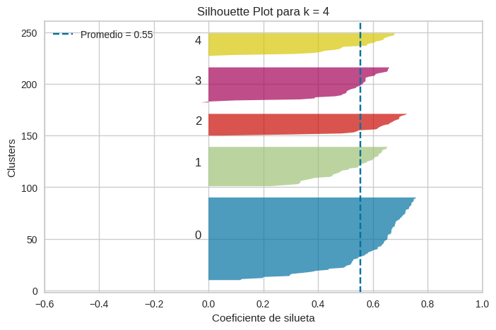
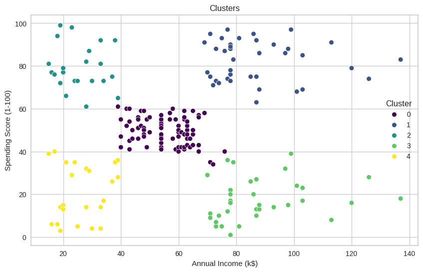
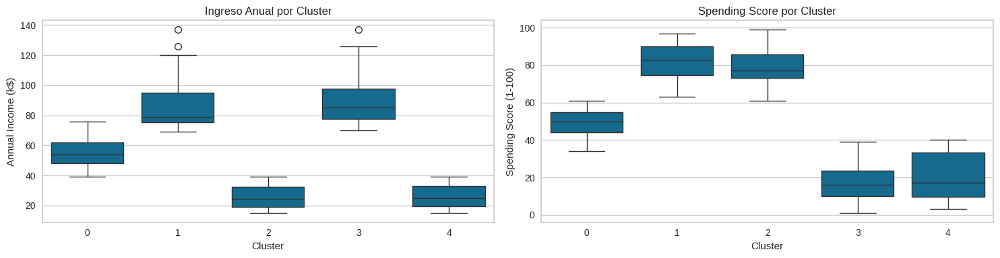

# 🛍️ Customer Segmentation using K-Means Clustering

### Customer Analytics & Unsupervised Machine Learning


---

# 📌 Descripción del Proyecto

Este proyecto consiste en la segmentación de clientes mediante técnicas de Machine Learning no supervisado, con el objetivo de identificar grupos de consumidores con comportamientos similares.

Utilizando el algoritmo K-Means Clustering, se analizaron patrones de ingresos y gasto para descubrir segmentos de clientes que puedan ser utilizados en estrategias de marketing, fidelización y personalización comercial.

El objetivo principal fue transformar datos de comportamiento del cliente en información accionable para la toma de decisiones empresariales.

---

# 🎯 Objetivos del Proyecto

* Realizar un análisis exploratorio del comportamiento de los clientes.
* Identificar patrones de consumo y gasto.
* Construir segmentos de clientes utilizando K-Means.
* Determinar el número óptimo de clusters.
* Interpretar cada segmento desde una perspectiva de negocio.
* Proponer estrategias de marketing basadas en los resultados obtenidos.

---

# 📊 Dataset

## Fuente

Mall Customer Segmentation Dataset

## Variables Utilizadas

```text
Annual Income (k$)
Spending Score (1-100)
```

## Características del Dataset

* Información demográfica y de consumo.
* Clientes de un centro comercial.
* Variables numéricas continuas.
* Problema de aprendizaje no supervisado.
* Sin variable objetivo.

---

# 📈 Resumen del Problema

Las empresas generan grandes cantidades de información sobre el comportamiento de sus clientes, pero frecuentemente carecen de mecanismos para identificar grupos con características similares.

La segmentación de clientes permite diseñar campañas específicas para cada perfil, optimizar recursos de marketing y aumentar el valor generado por cada cliente.

Machine Learning ofrece herramientas para descubrir automáticamente estos segmentos sin necesidad de etiquetas previas.

---

# 🔍 Análisis Exploratorio de Datos (EDA)

Se realizó un análisis exploratorio para comprender la distribución de las variables y detectar posibles patrones.

## Distribución de Variables



### Hallazgo

Las variables de ingreso anual y nivel de gasto presentan una dispersión suficiente para identificar segmentos diferenciados de clientes.

---

## Matriz de Correlación



### Hallazgo

Se observó una baja correlación entre las variables principales, lo que sugiere comportamientos heterogéneos dentro de la población analizada.

---

## Relación entre Ingreso y Gasto



### Hallazgo

Visualmente se aprecian agrupaciones naturales que sugieren la existencia de múltiples segmentos de clientes.

---

# ⚙️ Preparación de Datos

## Selección de Variables

Para el análisis de clustering se utilizaron:

```text
Annual Income (k$)
Spending Score (1-100)
```

Estas variables representan dos dimensiones clave para la segmentación comercial:

* Capacidad económica.
* Comportamiento de consumo.

---

## Escalamiento

Las variables fueron estandarizadas mediante StandardScaler para evitar que diferencias de escala afectaran el proceso de clustering.

---

# 🤖 Modelo de Clustering

## K-Means Clustering

Se utilizó el algoritmo K-Means para identificar grupos homogéneos dentro de la base de clientes.

### Ventajas

* Fácil interpretación.
* Alta eficiencia computacional.
* Ampliamente utilizado en Customer Analytics.

---

# 📏 Selección del Número Óptimo de Clusters

## Método del Codo (Elbow Method)



### Interpretación

La reducción de inercia muestra un punto de inflexión alrededor de k = 5, indicando una disminución marginal de mejora a partir de ese valor.

---

## Silhouette Score



### Interpretación

Los resultados sugieren que cinco clusters ofrecen una buena separación entre grupos y una estructura interpretable para el negocio.

---

# 📊 Resultados de Segmentación

## Visualización de Clusters



Se identificaron cinco segmentos diferenciados de clientes.

---

# 📋 Perfil de los Clusters

| Cluster   | Perfil                   |
| --------- | ------------------------ |
| Cluster 0 | Clientes Balanceados     |
| Cluster 1 | Clientes Premium         |
| Cluster 2 | Jóvenes Gastadores       |
| Cluster 3 | Alto Ingreso, Bajo Gasto |
| Cluster 4 | Clientes de Bajo Valor   |

---

## Distribución de Clientes por Cluster



### Hallazgo

Los clientes se distribuyen de forma relativamente equilibrada entre los distintos segmentos identificados.

---

# 💡 Estrategias de Negocio

## Clientes Premium

* Programas VIP.
* Beneficios exclusivos.
* Estrategias de retención.

---

## Alto Ingreso, Bajo Gasto

* Campañas de activación.
* Promociones personalizadas.
* Cross-selling.

---

## Jóvenes Gastadores

* Programas de fidelización.
* Marketing digital segmentado.
* Recomendaciones personalizadas.

---

## Clientes de Bajo Valor

* Estrategias de captación.
* Promociones de entrada.
* Incentivos de frecuencia.

---

# 📋 Conclusiones

La aplicación de K-Means permitió identificar cinco segmentos claramente diferenciados de clientes.

### Hallazgos Principales

* Los clientes presentan patrones de gasto heterogéneos.
* Existen segmentos de alto valor con gran potencial de retención.
* Se identificó un grupo con alto ingreso pero bajo gasto susceptible a campañas de conversión.
* La segmentación facilita la personalización de estrategias comerciales.
* K-Means demostró ser una herramienta efectiva para Customer Analytics.

En consecuencia, los resultados obtenidos pueden servir como base para iniciativas de marketing basado en datos y optimización de la experiencia del cliente.

---

# 🛠️ Tecnologías Utilizadas

* Python
* Pandas
* NumPy
* Matplotlib
* Seaborn
* Scikit-Learn
* K-Means Clustering
* StandardScaler
* Jupyter Notebook
* Git
* GitHub

---

# 💼 Competencias Demostradas

## Data Science

* Exploratory Data Analysis (EDA)
* Data Cleaning
* Feature Selection
* Data Preprocessing

## Machine Learning

* Unsupervised Learning
* K-Means Clustering
* Cluster Evaluation
* Customer Segmentation

## Business Analytics

* Customer Analytics
* Market Segmentation
* Customer Profiling
* Data-Driven Decision Making

---

# 🎓 Aplicaciones

Este proyecto es representativo de problemas reales en:

* Retail
* E-Commerce
* Marketing Analytics
* Customer Relationship Management (CRM)
* Loyalty Programs
* Business Intelligence

---

## 👨‍💻 Autor

**Jhorman David Bernal Tapias**
Biochemical Engineering Student | Data Science & Machine Learning Portfolio

Proyecto desarrollado con fines educativos y de portafolio profesional.

