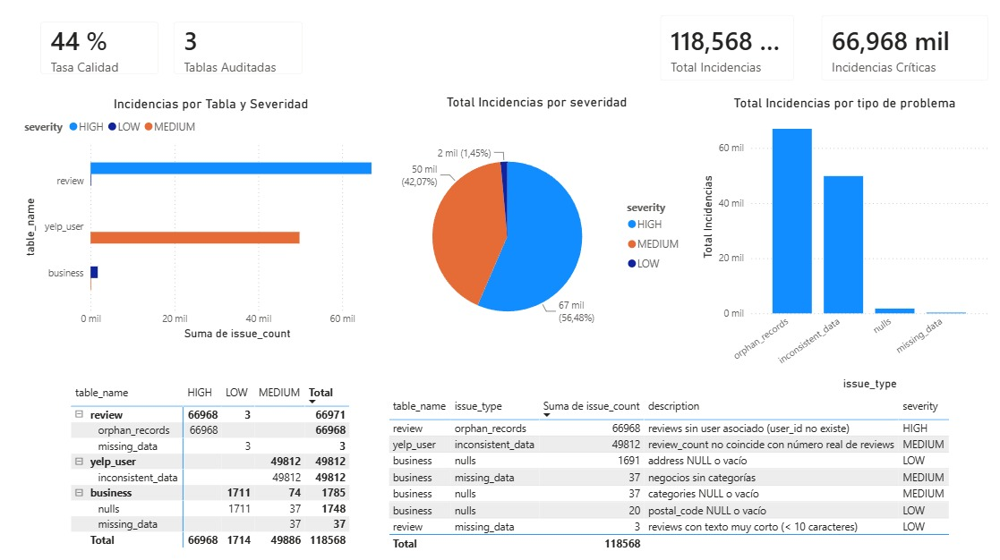
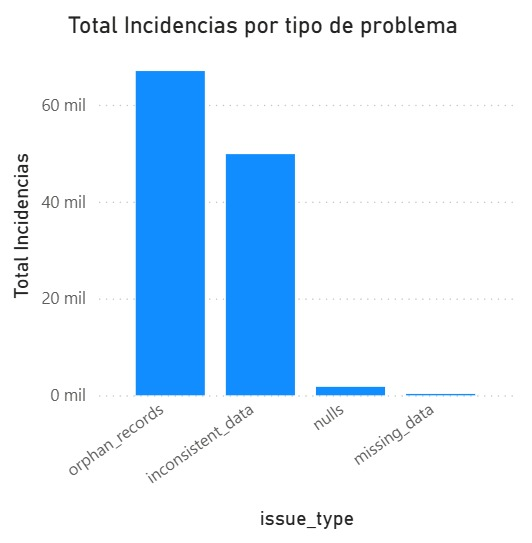
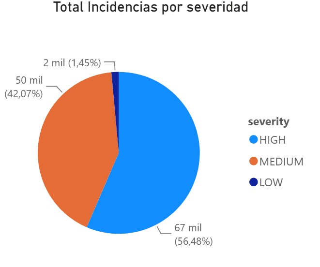

# 📊 SQL Data Quality Audit - Yelp Dataset

---

## 📌 Descripción del Proyecto

Auditoría de calidad de datos en el dataset de Yelp utilizando **SQL (PostgreSQL)** y **Power BI**.

---

## 🔍 Hallazgos Clave

| Hallazgo | Detalle |
|----------|---------|
| ⚠️ **Total Incidencias** | **118,568** problemas encontrados |
| 📊 **Tabla más crítica** | **review** (66,971 incidencias) |
| 🔴 **Mayor problema** | **66,968** reviews sin usuario asociado |
| 📈 **Tasa de Calidad** | **44%** |

---

## 📈 KPIs del Negocio

| Métrica | Valor |
|---------|-------|
| **Total Incidencias** | 118,568 |
| **Tablas Auditadas** | 3 |
| **Incidencias Críticas (HIGH)** | 66,968 (56.5%) |
| **Incidencias Medias (MEDIUM)** | 49,886 (42.1%) |
| **Incidencias Bajas (LOW)** | 1,714 (1.4%) |
| **Tasa de Calidad** | 44% |

---

## 📊 Distribución por Tabla

| Tabla | HIGH | MEDIUM | LOW | Total |
|-------|------|--------|-----|-------|
| **review** | 66,968 | 0 | 3 | 66,971 |
| **yelp_user** | 0 | 49,812 | 0 | 49,812 |
| **business** | 0 | 37 | 1,711 | 1,748 |

---

## 📋 Tipos de Problemas Encontrados

| # | Problema | Tabla | Count | Severidad |
|---|----------|-------|-------|-----------|
| 1 | Reviews sin usuario asociado | review | 66,968 | HIGH |
| 2 | review_count no coincide | yelp_user | 49,812 | MEDIUM |
| 3 | address NULL o vacío | business | 1,691 | LOW |
| 4 | Negocios sin categorías | business | 37 | MEDIUM |
| 5 | categories NULL o vacío | business | 37 | MEDIUM |
| 6 | Reviews con texto muy corto | review | 3 | LOW |

---

## 🛠️ Tecnologías Utilizadas

| Herramienta | Uso |
|-------------|-----|
| **PostgreSQL** | Base de datos y consultas SQL |
| **pgAdmin4** | Administración de base de datos |
| **Power BI** | Dashboard y visualizaciones |
| **Python** | Carga de datos a PostgreSQL |

---

## 📊 Dashboard en Power BI

### Vista General del Dashboard

### Incidencias por Tabla y Severidad

### Incidencias por Tipo de Problema

### Distribución de Severidad

---

## 📂 Estructura del Proyecto

