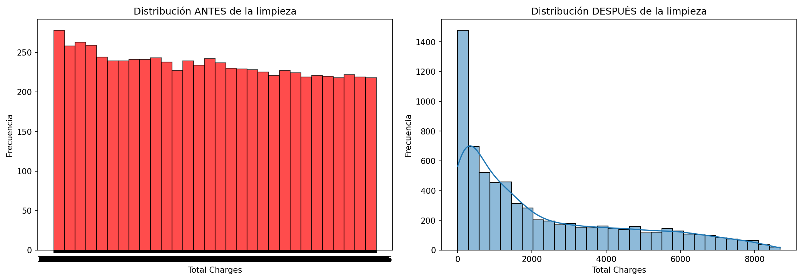
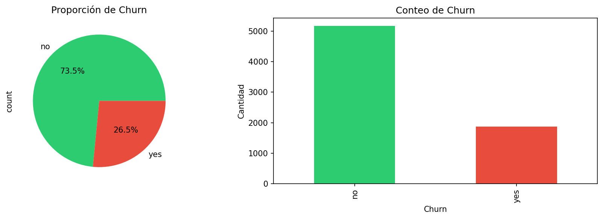
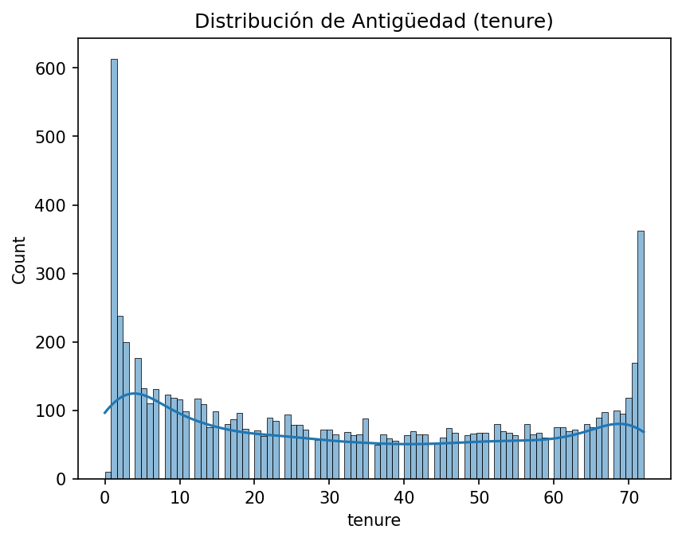
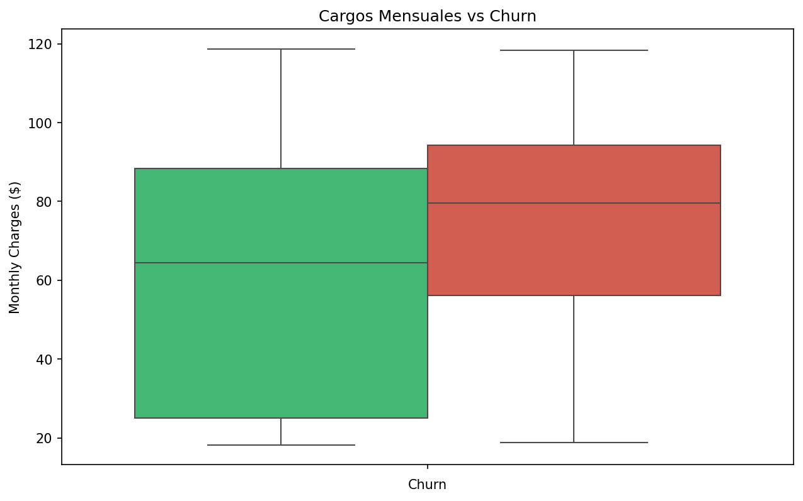
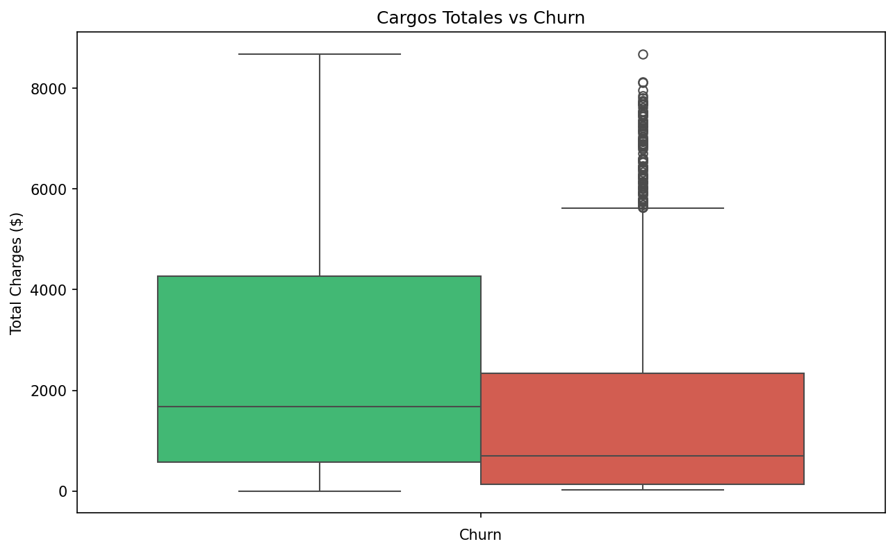
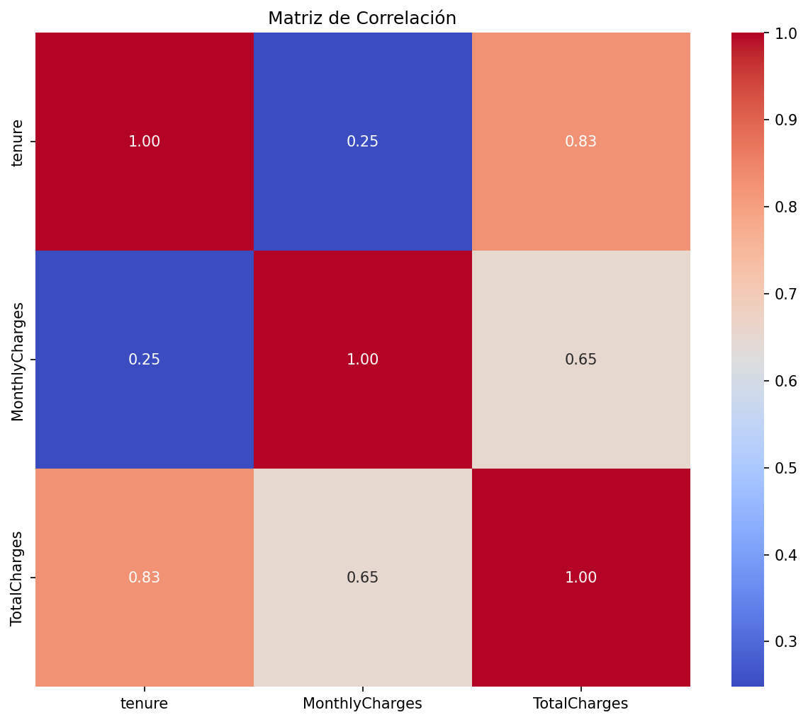
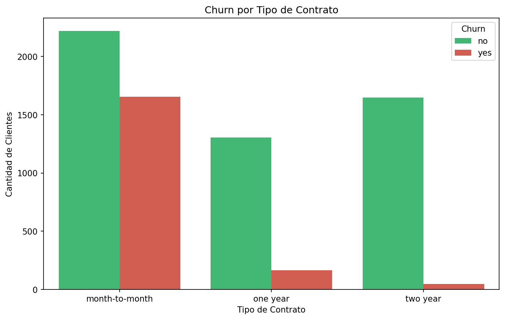

# 📊 Análisis de Churn - Telco Customer Churn

[](https://colab.research.google.com/drive/10fmcGYH-SMXvJ_WVdIqdiW1gTblKS_xl?usp=sharing)

---

## 📌 Descripción del Proyecto

Este proyecto consiste en la **limpieza y análisis exploratorio de datos (EDA)** de una empresa de telecomunicaciones, con el objetivo de identificar patrones de **churn** (clientes que cancelan el servicio).

El análisis incluye:
- ✅ Limpieza y transformación de datos
- ✅ Visualizaciones univariantes y bivariantes
- ✅ Cálculo de KPIs clave del negocio
- ✅ Insights y recomendaciones estratégicas

---

## 🔍 Hallazgos Clave

| Hallazgo | Detalle |
|----------|---------|
| ⚠️ **Tasa de Churn** | **26.54%** (1 de cada 4 clientes se va) |
| 📉 **Clientes nuevos** | Alto riesgo en el primer mes (tenure=0) |
| 📋 **Contrato mensual** | Mayor probabilidad de churn |
| 💳 **Electronic check** | Método de pago con mayor churn |
| 🌐 **Fiber optic** | Mayor churn que DSL |

---

## 📈 KPIs del Negocio

| Métrica | Valor |
|---------|-------|
| **Total Clientes** | 7,043 |
| **Clientes Perdidos** | 1,869 |
| **Tasa de Churn** | 26.54% |
| **Tasa de Retención** | 73.46% |
| **Ingreso Mensual Promedio** | $64.76 |
| **Ingreso Total Promedio** | $2,279.73 |
| **Antigüedad Promedio** | 32.4 meses |
| **Clientes Nuevos (tenure=0)** | 11 (0.16%) |

---

## 🛠️ Tecnologías Utilizadas

| Herramienta | Uso |
|-------------|-----|
| **Python** 🐍 | Lenguaje principal |
| **Pandas** | Limpieza y manipulación de datos |
| **NumPy** | Operaciones numéricas |
| **Matplotlib** | Visualizaciones |
| **Seaborn** | Visualizaciones estadísticas |
| **KaggleHub** | Descarga del dataset |

---

## 📂 Estructura del Proyecto


---

## 📊 Visualizaciones

| Gráfica | Descripción |
|---------|-------------|
|  | Distribución de Total Charges (Antes/Después) |
|  | Distribución de Churn |
|  | Distribución de Antigüedad |
|  | Distribución de Cargos Mensuales |
|  | Churn vs Antigüedad |
|  | Churn vs Cargos Mensuales |
|  | Churn vs Cargos Totales |
|  | Matriz de Correlación |
|  | Churn por Tipo de Contrato |
|  | Churn por Método de Pago |
|  | Churn por Tipo de Internet |
|  | Tasa de Churn vs Antigüedad |

---

## 💡 Recomendaciones para el Negocio

| # | Recomendación | Impacto |
|---|---------------|---------|
| 1 | **Programa de onboarding** para clientes nuevos (tenure=0) | Reducir churn temprano |
| 2 | **Descuentos por fidelización** para contratos mensuales | Retener clientes |
| 3 | **Incentivar pago automático** (especialmente Electronic check) | Reducir churn |
| 4 | **Revisar calidad del servicio Fiber optic** | Mejorar satisfacción |
| 5 | **Monitorear tasa de churn mensualmente** | Detectar problemas a tiempo |

---

## 🚀 Cómo Ejecutar el Proyecto

### 1. Clonar el repositorio
```bash
git clone https://github.com/[TU_USUARIO]/03-python-data-cleaning.git
cd 03-python-data-cleaning
